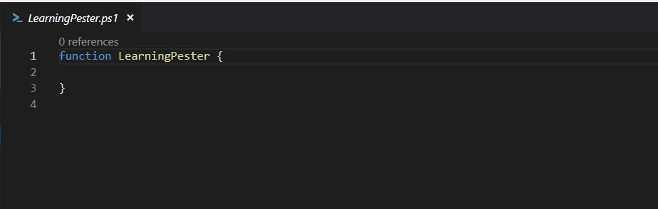
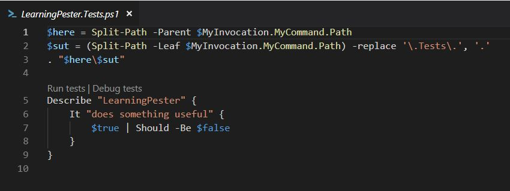
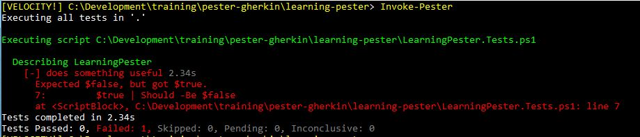
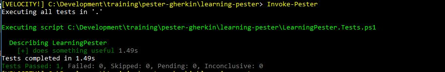
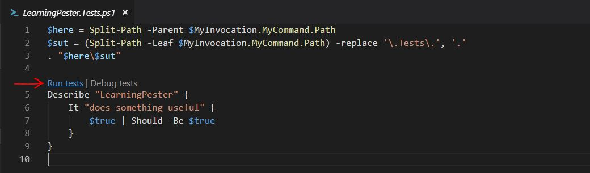

# Pester

PowerShell Pester is an open source unit testing framework designed to test PowerShell scripts.  It's syntax is a bit different from Powershell's.  

PowersShell 5.0 or higher already contains Pester.  

To install Pester, or to upgrade it to the latest version:
```powershell
Install-Module -Name Pester -Force -SkipPublisherCheck
```
Naming convention for test scripts - `<ScriptName>.Tests.ps1`

### New-Fixture
New-Fixture is a cmdlet that is shipped within the pester module. It allows us to pre-create an empty script together with an empty test file. It is the fastest way to get you started from scratch.
```powershell 
New-Fixture -Path .\ -Name LearningPester
```

&nbsp;

The New-Fixture cmdlet creates two files.

An empty script:



&nbsp;

And a pester test file:



&nbsp;

The blocks in the test script:
- `Describe` - A way of grouping and naming a series of tests in a block.
- `It` - A wrapper for the test
- `Should` - A piping action - a way to assert and determine if the test passed or failed.


### Running a Pester test
From a PowerShell window, use the `Invoke-Pester` cmdlet in the folder that contains the test.

Example:



&nbsp;

The test fails because `$true | Should -Be $false` evaluates to false.

Changing the test statement to `$true | Should -Be $true` will make the test pass.

After making the change and running `Invoke-Pester`, the test passes.



&nbsp;

##### MS Code - Cucumber (Gherkin) Full Support Extension 
**NOTE**: If using `Microsoft Code` as your editor, installing the `Cucumber (Gherkin) Full Support` extension will allow you to run and debug tests from within `Microsoft Code`



