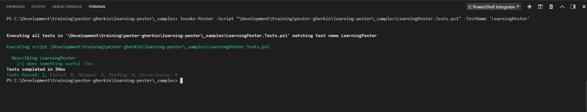

# Pester

PowerShell Pester is an open source unit testing framework designed to test PowerShell scripts.  It's syntax is a bit different from Powershell's.  

PowersShell 5.0 or higher already contains Pester.  

To install Pester, or to upgrade it to the latest version:
```powershell
Install-Module -Name Pester -Force -SkipPublisherCheck
```
Naming convention for test scripts - `<ScriptName>.Tests.ps1`

## New-Fixture
New-Fixture is a cmdlet that is shipped within the pester module. It allows us to pre-create an empty script together with an empty test file. It is the fastest way to get you started from scratch.
```powershell 
New-Fixture -Path .\ -Name LearningPester
```

&nbsp;

The New-Fixture cmdlet creates two files.

An empty script:


&nbsp;

And a pester test file:


&nbsp;

The blocks in the test script:
- `Describe` - A way of grouping and naming a series of tests in a block.
- `It` - A wrapper for the test
- `Should` - A piping action - a way to assert and determine if the test passed or failed.

**NOTE**: Generating the fixture is not the general process when creating tests.  Normally, we create the test file without the use of the cmdlet.

### Running a Pester test
From a PowerShell window, use the `Invoke-Pester` cmdlet in the folder that contains the test.

Example:


&nbsp;

The test fails because `$true | Should -Be $false` evaluates to false.

Changing the test statement to `$true | Should -Be $true` will make the test pass.

After making the change and running `Invoke-Pester`, the test passes.


&nbsp;

##### MS Code - Cucumber (Gherkin) Full Support Extension 
**NOTE**: If using `Microsoft Code` as your editor, installing the `Cucumber (Gherkin) Full Support` extension will allow you to run and debug tests from within `Microsoft Code`
The extension can be found at: https://marketplace.visualstudio.com/items?itemName=alexkrechik.cucumberautocomplete


&nbsp;

After clicking `Run Tests` above the `Describe` block, the integrated terminal is launched within MS Code and the test script is run




## Key Word Heirarchy
### Describe
A block used to group tests together.

### Context
A block that gives additional context to specific tests. (optional)

### It
A block that contains the element that is being tested. It will contain assertion operators for test validation.

### Should
variables are piped to `Should` and assertions are used based on the key word following `Should`.

### Operators <sup>[1](#ShouldOperators)</sup>
**NOTE**: 
For negative assertions, prefix operators with `-Not`, for example: 
```powershell 
$true | Should -Not -Be $false`
```

##### Be
Compares one object with another for equality and throws if the two objects are not the same. This comparison is not case sensitive.
```powershell
$actual="Actual value"
$actual | Should -Be "actual value" # Test will pass
$actual | Should -Be "not actual value"  # Test will fail
```

##### BeExactly
Compares one object with another for equality and throws if the two objects are not the same. This comparison is case sensitive.
```powershell
$actual="Actual value"
$actual | Should -BeExactly "Actual value" # Test will pass
$actual | Should -BeExactly "actual value" # Test will fail
```

##### BeGreaterThan
Asserts that a number is greater than an expected value. Uses PowerShell's -gt operator to compare the two values. 

```powershell
$Error.Count | Should -BeGreaterThan 0
[version]'2.3.4.5' | Should -BeGreaterThan ([version]'1.0.0.1')
(Get-Date).AddMinutes(5) | Should -BeGreaterThan (Get-Date)
```
##### BeGreaterOrEqual
Asserts that a number (or other comparable value) is greater than or equal to an expected value. Uses PowerShell's -ge operator to compare the two values.
```powershell
2 | Should -BeGreaterOrEqual 0
2 | Should -BeGreaterOrEqual 2
```
##### BeIn
Asserts that the actual value is contained by the array/collection
```powershell
'b' | Should -BeIn @('a','b','c')
27 | Should -BeIn (1..100)
```
##### BeLessthan
Asserts that a number is less than an expected value. Uses PowerShell's -lt operator to compare the two values.
```powershell
$Error.Count | Should -BeLessThan 1
```

##### BeLessOrEqual
Asserts that a number (or other comparable value) is lower than, or equal to an expected value. Uses PowerShell's -le operator to compare the two values.
```powershell
1 | Should -BeLessOrEqual 10
10 | Should -BeLessOrEqual 10
```

##### BeLike
Asserts that the actual value matches a wildcard pattern using PowerShell's -like operator. This comparison is not case-sensitive.
```powershell
$actual="Actual value"
$actual | Should -BeLike "actual *" # Test will pass
$actual | Should -BeLike "not actual *" # Test will fail
```

##### BeLikeExactly
Asserts that the actual value matches a wildcard pattern using PowerShell's -clike operator. This comparison is case-sensitive.
```powershell
$actual="Actual value"
$actual | Should -BeLikeExactly "Actual *" # Test will pass
$actual | Should -BeLikeExactly "actual *" # Test will fail
```

##### BeOfType
Asserts that the actual value should be an object of a specified type (or a subclass of the specified type) using PowerShell's -is operator:
```powershell
$actual = Get-Item $env:SystemRoot
$actual | Should -BeOfType System.IO.DirectoryInfo   # Test will pass; object is a DirectoryInfo
$actual | Should -BeOfType System.IO.FileSystemInfo  # Test will pass; DirectoryInfo base class is FileSystemInfo
$actual | Should -BeOfType System.IO.FileInfo        # Test will fail; FileInfo is not a base class of DirectoryInfo
```
##### BeTrue
Asserts that the value is true, or truthy.
```powershell
$true | Should -BeTrue
1 | Should -BeTrue
1,2,3 | Should -BeTrue
```

##### BeFalse
Asserts that the value is false, or falsy.
```powershell
$false | Should -BeFalse
0 | Should -BeFalse
$null | Should -BeFalse
```
##### HaveCount
Asserts that a collection has the expected amount of items.
```powershell
1,2,3 | Should -HaveCount 3
```

##### Contain
Asserts that the collection contains value specified using PowerShell's -contains operator.
```powershell
'a','b','c' | Should -Contain b
1..100 | Should -Contain 42
```
##### Exist
Does not perform any comparison but checks if the object calling Exist is present in a PS Provider. The object must have valid path syntax. It essentially must pass a Test-Path call.
```powershell
$actual=(Dir . )[0].FullName
Remove-Item $actual
$actual | Should -Exist # Test will fail
```
To test path containing [ ] wildcards, escape each bracket with two back-ticks as such 
`"TestDrive:\``[test``].txt" or use Test-Path -LiteralPath $something | Should -Be $true`.

##### FileContentMatch
Checks to see if a file contains the specified text. This search is not case sensitive and uses regular expressions.
```powershell
Set-Content -Path TestDrive:\file.txt -Value 'I am a file'
'TestDrive:\file.txt' | Should -FileContentMatch 'I Am' # Test will pass
'TestDrive:\file.txt' | Should -FileContentMatch '^I.*file$' # Test will pass

'TestDrive:\file.txt' | Should -FileContentMatch 'I Am Not' # Test will fail
```
*Tip*: Use [regex]::Escape("pattern") to match the exact text.
```powershell
Set-Content -Path TestDrive:\file.txt -Value 'I am a file.'
'TestDrive:\file.txt' | Should -FileContentMatch 'I.am.a.file' # Test will pass
'TestDrive:\file.txt' | Should -FileContentMatch ([regex]::Escape('I.am.a.file')) # Test will fail
```
*Warning*: Make sure the input is either a quoted string or an Item object. Otherwise PowerShell will try to invoke the path, likely throwing an error Cannot run a document in the middle of a pipeline.
```powershell
c:\file.txt |  Should -FileContentMatch something # Will throw an error
'c:\file.txt' |  Should -FileContentMatch something # Will evaluate correctly
```

##### FileContentMatchExactly
Checks to see if a file contains the specified text. This search is case sensitive and uses regular expressions to match the text.
```powershell
Set-Content -Path TestDrive:\file.txt -Value 'I am a file.'
'TestDrive:\file.txt' | Should -FileContentMatchExactly 'I am' # Test will pass
'TestDrive:\file.txt' | Should -FileContentMatchExactly 'I Am' # Test will fail
```

##### FileContentMatchMultiline
As opposed to FileContentMatch and FileContentMatchExactly operators, FileContentMatchMultiline presents content of the file being tested as one string object, so that the expression you are comparing it to can consist of several lines.
```powershell
$Content = "I am the first line.`nI am the second line."
Set-Content -Path TestDrive:\file.txt -Value $Content -NoNewline
'TestDrive:\file.txt' | Should -FileContentMatchMultiline 'first line\.\r?\nI am' # Test will pass
'TestDrive:\file.txt' | Should -FileContentMatchMultiline '^I am the first.*\n.*second line\.$' # Test will pass.
```
When using FileContentMatchMultiline operator, `^` and `$` represent the beginning and end of the whole file, instead of the beginning and end of a line.
```powershell
$Content = "I am the first line.`nI am the second line."
Set-Content -Path TestDrive:\file.txt -Value $Content -NoNewline
'TestDrive:\file.txt' | Should -FileContentMatchMultiline '^I am the first line\.$' # Test will fail.
```

##### Match
Uses a regular expression to compare two objects. This comparison is not case sensitive.
```powershell
"I am a value" | Should -Match "I Am" # Test will pass
"I am a value" | Should -Match "I am a bad person" # Test will fail
```
*Tip*: Use [regex]::Escape("pattern") to match the exact text.
```powershell
"Greg" | Should -Match ".reg" # Test will pass
"Greg" | Should -Match ([regex]::Escape(".reg")) # Test will fail
```

##### MatchExactly
Uses a regular expression to compare two objects. This comparison is case sensitive.
```powershell
"I am a value" | Should -MatchExactly "I am" # Test will pass
"I am a value" | Should -MatchExactly "I Am" # Test will fail
```

##### Throw
Checks if an exception was thrown in the input ScriptBlock. Takes an optional argument to indicate the expected exception message.
```powershell
{ foo } | Should -Throw # Test will pass
{ $foo = 1 } | Should -Throw # Test will fail
{ foo } | Should -Not -Throw # Test will fail
{ $foo = 1 } | Should -Not -Throw # Test will pass
{ throw "This is a test" } | Should -Throw "This is a test" # Test will pass
{ throw "bar" } | Should -Throw "This is a test" # Test will fail
```
*Note*: The exception message match is a substring match, so the following assertion will pass:
```powershell
{throw "foo bar baz"} | Should -Throw "bar" # Test will pass
```
*Warning*: The input object must be a ScriptBlock, otherwise it is processed outside of the assertion.
```powershell
Get-Process -Name "process" -ErrorAction Stop  | Should -Throw # Should pass but fails the test
```

##### BeNullOrEmpty
Checks values for null or empty (strings). The static [String]::IsNullOrEmpty() method is used to do the comparison.
```powershell
$null | Should -BeNullOrEmpty # Test will pass
$null | Should -Not -BeNullOrEmpty # Test will fail
@()   | Should -BeNullOrEmpty # Test will pass
""    | Should -BeNullOrEmpty # Test will pass
```


&nbsp;

<span style='font-size:0.75em; color:grey'> 
<a name="ShouldOperators">1</a>: The `Should` operators were obtained from: https://github.com/pester/Pester/wiki/Should               
</span>


